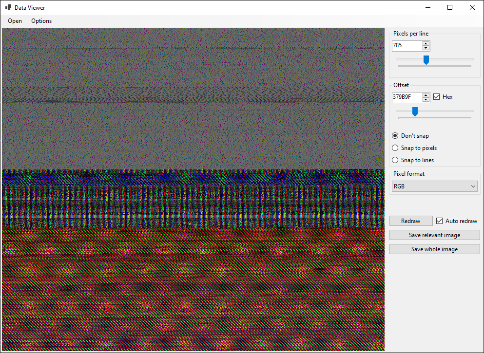
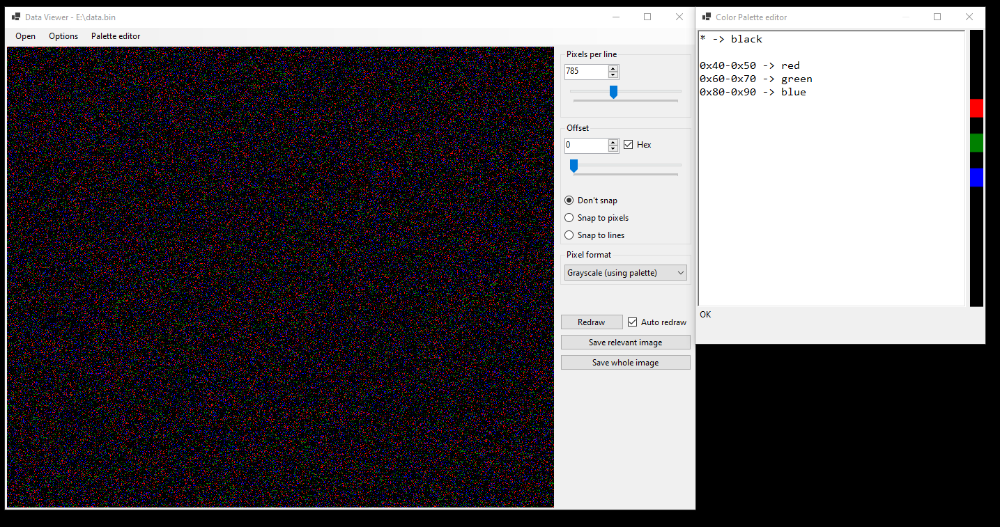

### What is this?
This is a simple C#/WinForms tool to graphically visualise/interpret arbitrary bytes as an image, in different color formats.

### Quick guide
The interface should be pretty explanatory. Drag any file on top of the app, or open it through the menu, and you should immediately see an image. Drag the sliders on the right to adjust the view. The options menu can be used to create a larger-than-the-default 2048x1000 view.

#### Color palette
In grayscale view, the color palette can be customized beyond the default grey colors, by using the "Palette editor".

The color palette description format, as taken from the app:

    this is a textual description of a color palette
    lines starting with # are ignored, as well as empty lines
    lines are parsed like a program, top to bottom, and can get overwritten by lower lines
    a preview of the palette is visible to the right
    
    format:
      lines are made up of two elements separated by "->"
      the first element represents the byte value of it's pixel, in either decimal, 0xXX or XXh form
        if *, the rule applies to all values
        the first line can also specify a range, with a dash between the two values (eg 10h-20h)
     the second element represents the color value
        if *, it directly maps the byte value to its grayscale value
        the color can be specified in a hex string (eg #00ff00), with the # being optional
        or it can be a known color string (eg "red")

### Download
Either clone and build it yourself, or fetch a binary from the Github Releases section.

### Compiling info
Nothing special. .NET 5.0 required.
Tested only on Windows systems, but it might also work on UNIX.
